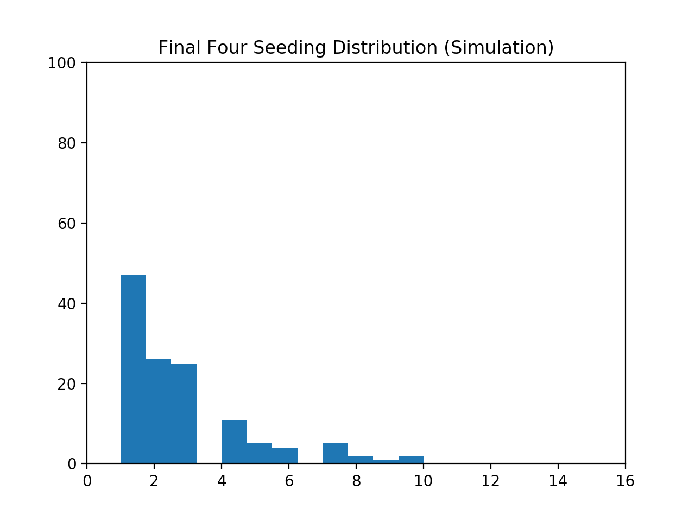

# march-madness

## Installation + Execution

To run, make sure you've installed Python3, matplotlib, and numpy. Then simply execute `$ python3 sim_tournament.py`.

## Why?

I wanted to get my feet wet with data mining, and this seemed like a good way to start. I actually wrote a blog post about [this](https://medium.com/@captainsidd/how-does-seeding-correlate-to-success-in-march-madness-fa44afe60e90#.8r2gl689g) that I've copied below.

### Blog Post
How Does Seeding Correlate To Success in March Madness?

So I found a dataset that listed the scores, the seeds, and teams that made it to each round for every dance since 1985. And since I’m a huge nerd, I thought to myself: could I predict the Final Four based on the statistical likeliness of a seed advancing to the next round? 

Now, I’m just doing this for fun — I want to explore more of the world of data mining, and since I’m just starting out, I wanted to keep my model and simulations simple. I didn’t throw any machine learning algorithms at the data, I didn’t take into account +/-, 3 point percentage, or any other basketball specific statistics. If you want to see what people got when they did take all those into account, check out the genius community at Kaggle. The only attribute I looked at was seeding, and the only statistics I ran was the similarity ratio between my simulation and historical data. 

In a world with perfect parity, the chance of each team advancing to the next round is .500. But we’re introducing seeding, so the team with a higher seed should win more often because theoretically, they’re better. So how to represent this in our model? Simple — skew the probability of winning proportional to the difference in the seeds. We’ll divide by 32 in order to maximize the chance that the lower seed wins, because anything can happen in March Madness.

So now, we sim a tournament. Start with 16 seeds, find the champion of that bracket, and repeat three more times to find your Final Four. That’s one tournament. Now do that ten thousand times, pick 128 random seeds from that set, and compare that distribution to the distribution of seeds that happened in real life. We pick 128 because that’s how many team have made the Final Four in the current 64 team format. The first time I ran my program, this was the result: 

Sidenote: I did something bad and didn’t label my axes. Just so you know, all graphs have the seeding on the x-axis and the number of occurrences in the Final Four on the y-axis.

Pretty similar right? Given that my similarity ratio between these two datasets was .25, with 0 being not similar at all and 1 being completely identical, this was really encouraging! I got really excited and tweeted my genius to the world, only to realize that my simulation is a completely random selection of my simulated final four and if I run it again there’s a possibility that my graph ends up looking like this:

Ok, so now I needed a way to consistently generate the best results. My initial solution was to simply simulate more tournaments, find a random 128 seeds, and hope that would fix the problem. Hint: it didn’t. I kept getting random data, because I was simply selecting a single 128 seed sample. So I apply things I learned in class (\*gasp\*), and find the statistically best 128 seed sample, found by iterating through a shuffled list of seeds. This guarantees that I use the best subset from my simulation, while still picking a “random” subset.

So what’s the data that we get from this? Well, my initial running of this version of the program had a similarity ratio of .555 and looked like this: 

Compare this the historical data found above. Subsequent runs of the program, this time done with 500000 simulated tournaments, yielded similarly distributed results. But now, I needed to be able to predict the winning seeds of the Final Four without throwing some sort of “deep learning” at this dataset. Since I was dealing with shuffled arrays of seeds, I picked at random, the first four seeds found in my simulated data on the next run of the program:

Since I dealt with the individual divisions as if they were identical, this simulation isn’t quite specific. So, let’s add some actual basketball knowledge into this, and get our Final Four.

* East: Villanova (1) *because they won last year*
* Midwest: Michigan (7) *because “it’s close to Detroit”  homerism*
* South: UCLA (3) *because I want Lonzo Ball to be a Sixer*
* West: Gonzaga (1) *because everyone says they’re really good*

Obviously, if this turns out to be true no one is going to be more surprised than me. But this was a fun project that I had a blast doing, and hopefully once I have more experience with data mining under my belt I can revisit this and add some machine learning and additional complexity to my model. The code can be found on my GitHub, and I’d love any feedback — email me at me@captainsidd.com, or slide into my DMs on Twitter.
